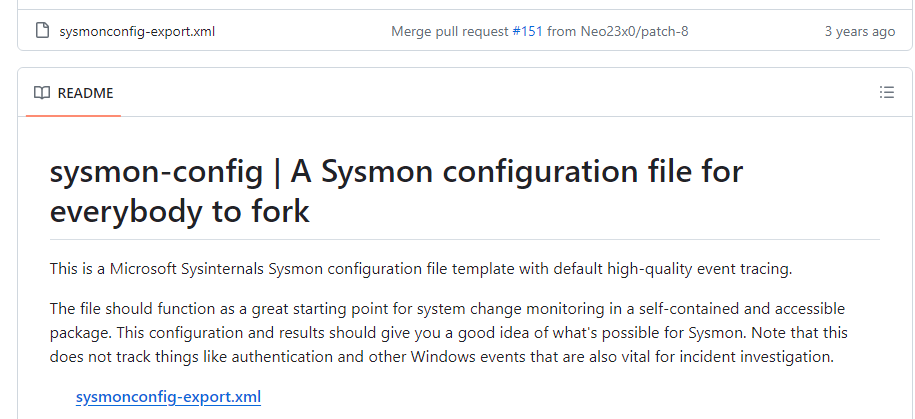

# Splunk-Sysmon-Lab

## Sysmon Installation

First, download Sysmon or you can download the Sysinternals Utilities Suite which has sysmon. Links to download below

Sysmon Link: [Sysmon](https://learn.microsoft.com/en-us/sysinternals/downloads/sysmon)

Sysinternals Link: [Sysinternals](https://learn.microsoft.com/en-us/sysinternals/downloads/)

Extract files to somewhere easily found, will need to path to this location to install Sysmon later.

Next, download the configuration file made by SwiftOnSecurity [config link](https://github.com/SwiftOnSecurity/sysmon-config). This is a great starting point for Sysmon logs. The config file has great documentation and can easily be customized to better fit different situations. Click on the sysmonconfig-export.xml link to preview the file. Then in the top right select Raw and save as to where you downloaded the Sysmon file.

Before installing Sysmon check to see if Sysmon is not already installed on the computer. In the start menu search for Services. This will bring up the Services page and search for Sysmon. If it is not there then Sysmon is not installed on this machine and continue with installation.

Open PowerShell as administrator and CD to the Sysmon folder. Enter command below to install Sysmon.

    .\Sysmon64.exe -accepteula -i .\sysmonconfig.xml .

Now Sysmon is installed on machine

Sysmon logs are located in Windows Event Viewer. They can be found: Application and Services Logs > Microsoft > Windows > Sysmon

## Splunk Install

To installing Splunk Enterprise go to [Splunk website](https://www.splunk.com/) and click on Products, then click on Splunk Enterprise. This will bring you to the Splunk Enterprise page where you can download a free trial. You will have to make an account to download Splunk Enterprise.

Once, Splunk Enterprise is downloaded run the msi to complete the setup of Splunk Enterprise. You will have to accept the license agreement and choose where you want Splunk to be installed on the computer.

Next, install Splunk as Local system.

Create a username and password that will be used to login to Splunk on the local machine.

Once finished, with the Splunk Enterprise installation to connect to Splunk use a loopback address to connect. In a search engine type

    127.0.0.1:8000

This will connect to Splunk on port 8000. Which is the default port for Splunk web on prem. Enter the username and password that was inputted when setting up Splunk Enterprise.

Signing on will bring you to the Splunk home page for that user.

## Sending Sysmon Logs to Splunk Enterprise

Now that Sysmon and Splunk are installed the next step is to send Sysmon logs to Splunk to be process. First, make a new index name Security. Start by click on the setting drop-down menu and click on the indexes tab. This will bring you to all the indexes available to the user. In the top right corner click on new index button and enter the name of the new index and I left the other values default.

Next, you need to tell Splunk where to find the Sysmon logs to do this you will to locate the input.conf. My file is located at.

     C:\Program Files\Splunk\etc\system\local

If this location does not have a configuration file then it can be copied from the default folder which can be found in the system folder.

Open the inputs.conf with a text editor and paste the following string in and save when done.

    [WinEventLog://Microsoft-Windows-Sysmon/Operational]
    index = Security
    disabled = false
    renderXml = true
    source = XmlWinEventLog:Microsoft-Windows-Sysmon/Operational
    sourcetype=Sysmon

This tells Splunk where the Sysmon logs are and how they should be processed.

To confirm these changes restart Splunk. In the windows start menu search for services and scroll down to Splunk Services. Right click and restart.

Now download the Splunk add-on for Sysmon. This will parse the Sysmon logs and create structured fields and values. To add the Sysmon app click on the App drop-down menu. Then, hit find more apps. Search for Splunk Add-on for Sysmon and install.

Sysmon logs are now being sent to Splunk. To see the Sysmon logs click on Search & Reporting, entering in this search.

    Index=security  sourcetype=sysmon

This search brings up the security index and the sourcetype of Sysmon

## Creating Alerts and Dashboards on Splunk

Creating an alert on Splunk is done by entering a search query. I am going to create an alert for failed login attempts on Windows. The logs for failed login attempts are found in the Security logs in Event Viewer. The event ID for a failed login attempt is 4625. Using this information, I was able to find the failed login attempts in Splunk.

    index=main sourcetype="WinEventLog:Security" EventCode=4625 earliest= -5m
    | eval Account_Name=mvindex(Account_Name,1)
    | stats count by host, Account_Name
    | where count >=5
    | rename count as Total_Attempts, host as Host

This query finds the failed login attempts in the last 5 minutes and counts by the host and account name. Then, if the count is greater than or equal to 5 the query adds a record to the statists tab in Splunk. To save the query as an alert click save as > alert. This will bring up the alert page where you can configure how the alert actions.

Above show, I named the alert and gave a description of alert. Then I set the alert type as cron schedule to trigger every 5 minutes and when triggered to add to triggered alerts as high severity.

To see triggered alerts click on activity then triggered alerts. This will open the triggered alerts page and will show all the triggered alerts that the user has access to.

Now, a person can do a deeper dive into the account that triggered the alert. Either, it is someone typing in the wrong password or a malicious actor trying to gain access to the user account.

A Dashboard is a centralized hub for monitoring and analyzing logs. To create a dashboard, click on the dashboard tab located in the top left corner of Splunk. This will bring you to the dashboard page, showing what Splunk dashboard user has available. Next, click Create New Dashboard in the top right corner. Name and configure the dashboard and save.

Now the dashboard is created time to add Splunk visualization like a table. To add a table in the top left corner, click on add table this will show the many different options available to add to the dashboard.

On the right side of the screen, an options menu will open for the table that was added. There you can add the search query by clicking on the create search option.

I added a table that displays Sysmon event types and a count of how many times the event happened. The query is below.

    index=security sourcetype=Sysmon
    | stats count by EventDescription 
    | table EventDescription, count 
    | sort count desc

To show a better view of the Sysmon logs I add two more tables. One that displays the top apps being used. The other one shows the latest image being run.

This completes the Splunk-Sysmon-Lab
