# Vulnerability-Management-Lab

## Nessus Installation

To start the Lab you will need to download the Nessus Essentials which is a free version of Tenable Nessus. The download link can be found here [Link](https://www.tenable.com/products/nessus/nessus-essentials).

Make an account to gain access to Nessus Essentials. Once downloaded, execute the .msi file to begin setup.

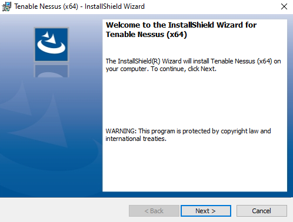

Agree to the license agreement and select the download folder of Nessus.

To log in to Nessus Essentials, use a local host address and the port number to connect to a search engine. I used  

    127.0.0.1:8834

This will bring use to the Nessus page where you must register to complete the installation. The key is found in an email sent to the email address that was used to register the account. Now that is taken care of, click continue on the Welcome to Nessus page.

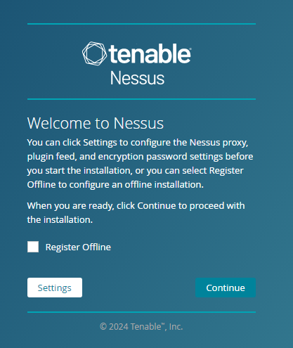

Next, select the register for Nessus Essentials and press continue. This will bring you to the Get an activation code page and click skip because you already have a code. Now, input the register key given to you by Nessus.

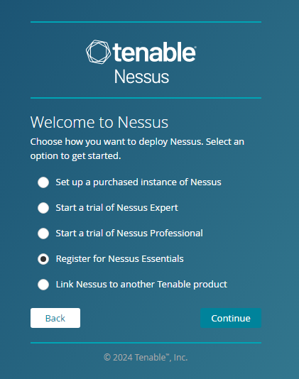

Wait for Nessus to install the lasted updates so you can be better prepared because Nessus will have the most up-to-date CVEs to analyze with. This will take away to complete.

## Configuring VM

Continuing on, now you need to set up a VM to test Nessus capabilities. To set up a VM follow this guild I did in a previous lab  [Link](https://github.com/RobertAtkins1/Cyber-Labs).

Now that the Windows 10 VM is up and running you need to find the IP of the VM. In a Windows command line input the following command.

    ipconfig  

Next, you need to test if the Nessus computer can reach the VM. To accomplish this, use the command ping to see if the two machines can communicate. You will use the ipv4 address of the VM obtained in the previous step.

This Ping should time out and the host be unreachable.

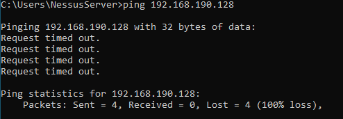

Windows firewall by default blocks ICMP pings, we need to change this to continue the lab. In Windows search type in

    wf.msc 

to quickly open the Windows firewall.

Now, click on Inbound Rules on the top left of the screen. Scroll down and find the rule named file and printer sharing (Echo request -ICMPv4-In). There will be multiple rules that have very similar names. Select the rule that has the profile set to Private, Public.

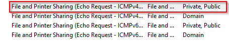

Double-click to open the properties of the firewall rule. Click enabled and click apply and ok to enable the rule.

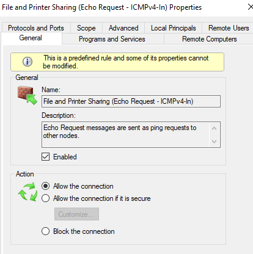

Now test the ping again, the ping should be able to reach the VM now.

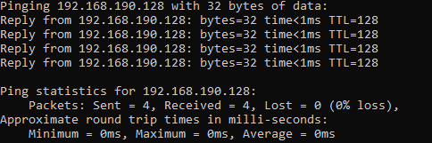

## Vulnerability Scanning on Nessus

Now, we determine that the Nessus machine can ping the VM. We can start the first scan of the VM. In the top right corner of the nessus home pate click New Scan to configure a new scan. This will bring you to the Scan Templates page where Nessus has many scans created to quickly find vulnerabilities. Select Basic Network Scan.

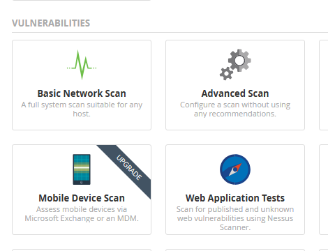

Give the scan a name and add the IP address of the VM that was found in previous steps. Click save to create a scan.

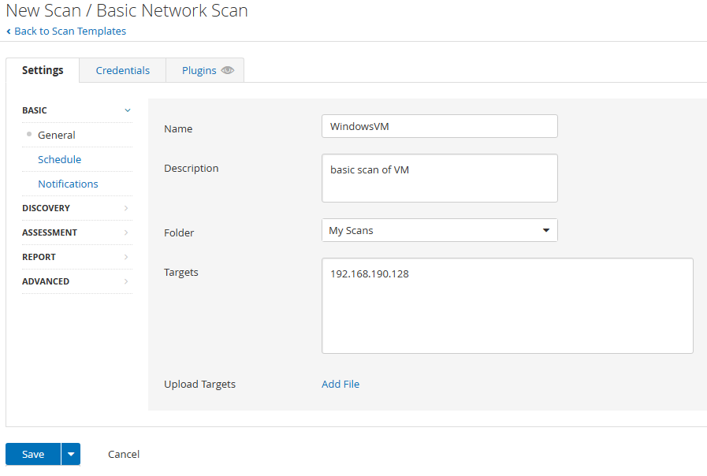

Now, it is time to start the scan. On the My Scans page on the right side click the launch button (looks like a play button) to begin the scan.

Once completed click the vulnerability tab to see what vulnerabilities the scan found.

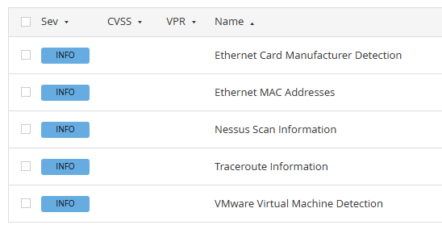

The Basic Network Scan does not come back with much, just Mac address information and the scanned IP is VM.

Now, perform a credential scan to see a deeper view of the vulnerability on the computer. Since the VM is not in a domain you will have to change some settings on the computer to allow Nessus to run a credential scan. Nessus provides documentation for this [Link](https://community.tenable.com/s/article/Scanning-with-non-default-Windows-Administrator-Account?language=en_US)

First, open services on VM and find remote registry. Double click and select automatic in the startup type drop-down menu then click start. Then, click apply and ok.

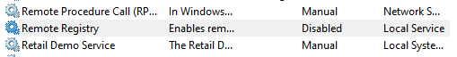

Second, search for advanced sharing settings in the Windows search. Here turn on file and printer sharing and turn on network discovery. Then click save changes.

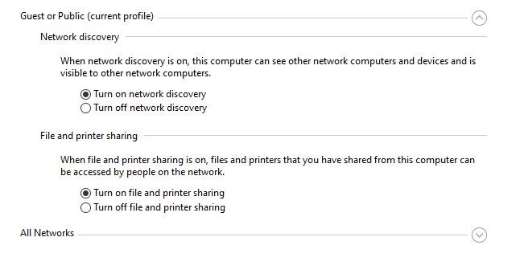

Third, search for user account control settings in Windows settings. Move the slider to Never notify and click ok.

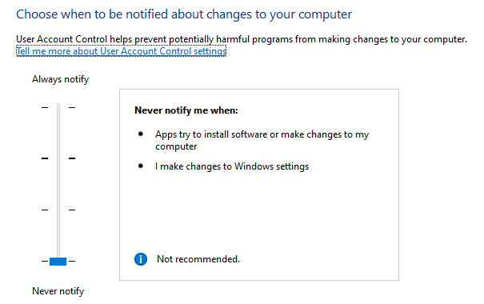

Fourth, open the registry editor and go to

    Computer\HKEY_LOCAL_MACHINE\SOFTWARE\Microsoft\Windows\CurrentVersion\Policies\System

There create a dword named LocalAccountTokenFilterPolicy and set the value to 1.

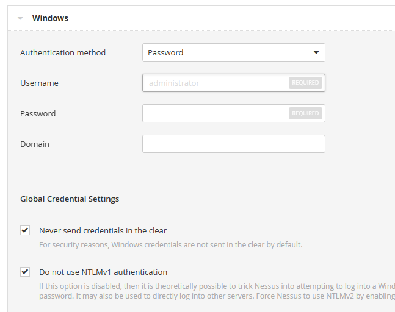

Finally restart the VM.

With these settings changed, perform a credentialed scan. In the scan created in the previous click configure in the top right corner. Then, click the credentials tab and select Windows. Here, input the username and password of the VM leave the Global Credential Settings default, and save.

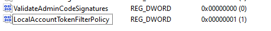

Now, launch the scan with the new credentials.

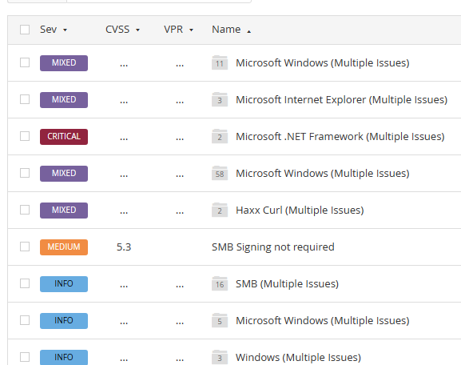

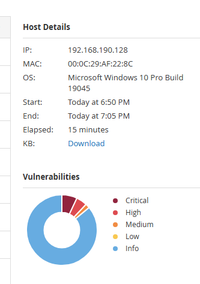

In total, Nessus found 42 vulnerabilities with various severity ratings. This show that Credentialed Scan will provide a better look into the vulnerability that on your network.

Next, I am going to download an older version of Firefox that has many vulnerabilities to simulate having out-of-date software and how the scan looks different from the others.

To download an older version of Firefox, go to [Link](https://ftp.mozilla.org/pub/firefox/releases/) and download.

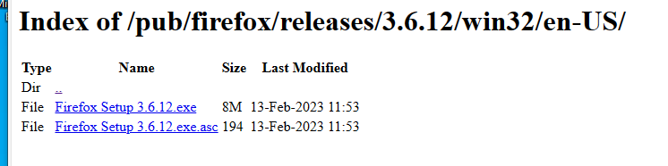

Run the exe and complete the setup for Firefox.

Now, run a scan with the older version of Firefox installed on the VM.

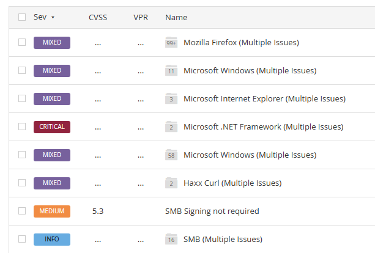

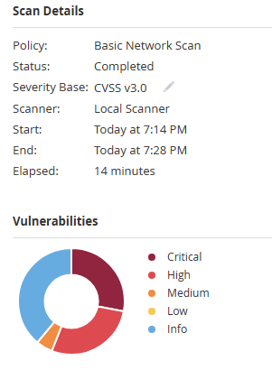

As you can see, having out-of-date software can dramatically increase the number of vulnerabilities that threat actors can use to exploit. This is why security professionals say to keep software updated.

Luckily, Nessus provides a Remediation tab. This provides a list of remediation steps that when followed will get rid of the vulnerabilities.

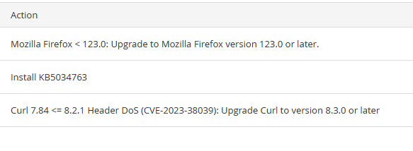

The Remediation tab says to update Firefox and update windows. I updated the items that were listed on the remediation tab and scanned the VM again.

Following the Remediation tab suggestion, I was able to greatly reduce the total amount of vulnerabilities and almost eliminate the critical and high-severity vulnerabilities.

This completes the Vulnerability-Management-Lab
